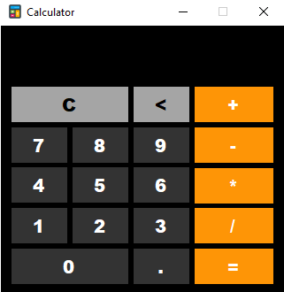
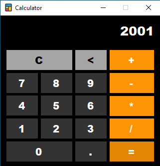
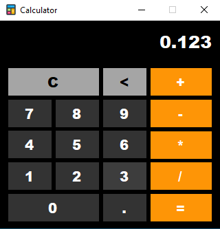

  
  <h1>Calculator</h1>

**"Calculator"** is a very simple Calculator.

## Requirements
 - .NET Framework v4.7.2

## Icons
All Icons are taken from [Flaticon](https://www.flaticon.com/).

## Screenshots

